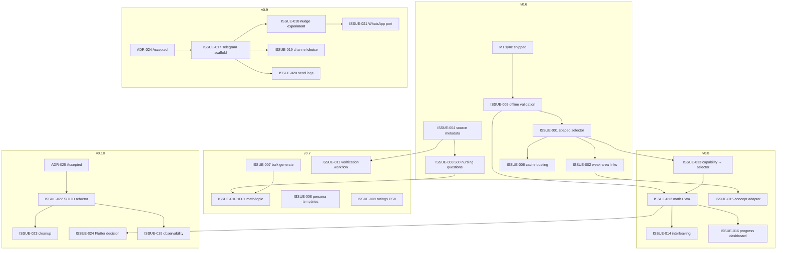

# Vikram-Powered Backlog — Dr. Math

**Date:** 2026-05-05  
**Repo:** `shivaramgoud/drmath`  
**Branch:** `main`  
**Purpose:** Apply the Vikram autonomous-PM framework (Functional Surgeon, Constraint Archaeologist, Sprint Sculptor) to the Dr. Math adaptive learning pipeline.

---

## 1. Vikram Personas, Customized for Dr. Math

### Functional Surgeon
Every requirement is sliced into an atomic learner or manager action, tagged as **FR** or **NFR**, and acceptance criteria are observable in the browser/device.

> Example: not *"build adaptive engine"* but *"as a nursing PWA user who answered a cardiovascular question incorrectly yesterday, today’s daily 5-question set must include that question or a sibling topic question before any unseen question."*

### Constraint Archaeologist
Explicitly surfaces the invisible blockers that have already burned time:

- **Content-bank size:** 40 math questions/topic and 130 nursing questions is a demo, not an adaptive bank.
- **ADR gates:** ADR-024 (Telegram/WhatsApp) and ADR-025 (SOLID refactor) are still `Proposed`; code cannot start until they are `Accepted`.
- **Flutter e2e gap:** The native app is a hardcoded UI shell; treating it as the primary mobile layer is a strategic error now documented and deferred.
- **SQLite single-thread assumptions:** offline sync must be idempotent because the same `client_attempt_id` may retry across reconnects.
- **DPDP Rules, 2025:** any messaging feature needs multilingual notice, itemized purpose, one-click withdrawal, and 1-year send logs.

### Sprint Sculptor
Sprints are sequenced by **dependency graph + risk adjacency**, not urgency. Each sprint ends with a demo that proves a learner behavior, not just a deployed artifact.

---

## 2. Label Taxonomy for Dr. Math

| Dimension | Labels |
|---|---|
| **type** | `type:FR`, `type:NFR`, `type:bug`, `type:spike`, `type:infra`, `type:migration` |
| **priority** | `priority:critical`, `priority:high`, `priority:medium`, `priority:low` |
| **module** | `module:pipeline`, `module:content`, `module:web`, `module:pwa`, `module:backend`, `module:db`, `module:sync`, `module:messaging`, `module:analytics`, `module:admin`, `module:flutter`, `module:infra` |
| **status** | `status:blocked`, `status:in-review`, `status:needs-design` |

---

## 3. Milestones → 25 Issues

| Milestone | Demo Goal | Key Issues |
|---|---|---|
| **v0.6 — Nursing PWA E2E** | A learner can answer offline, reconnect, and see weak-area questions resurface the next day. | ISSUE-001 … ISSUE-006 |
| **v0.7 — Content Pipeline Scale** | A manager can bulk-generate 100+ questions for a topic and download a ratings CSV. | ISSUE-007 … ISSUE-011 |
| **v0.8 — Adaptive Engine** | The math PWA picks daily questions by spaced repetition, not random sampling. | ISSUE-012 … ISSUE-016 |
| **v0.9 — Distribution & Messaging** | Telegram nudge experiment is live with channel choice and one-click withdrawal. | ISSUE-017 … ISSUE-021 |
| **v0.10 — Platform Hardening** | SOLID refactor merged, Flutter decision made, production health checks green. | ISSUE-022 … ISSUE-025 |

---

## 4. Issue Detail

### v0.6 — Nursing PWA E2E

#### ISSUE-001 — Spaced-repetition selector for nursing daily quiz
- **Labels:** `type:FR`, `priority:high`, `module:sync`, `module:pwa`
- **Functional surgeon view:** Given a `session_id`, the PWA must select today’s 5 questions using an SM-2-style queue before falling back to random unseen questions.
- **Acceptance criteria:**
  1. `last_seen_at` and `performance_history` are read from local IndexedDB.
  2. ≥30% of daily questions are previously-seen weak-area items when the history exists.
  3. A pure-random fallback runs only when local history is empty.
- **Dependencies:** ISSUE-005 (M1 sync validated) must close first.
- **Risks:** Content bank may still be too small for meaningful spacing.

#### ISSUE-002 — Weak-area summary linked to concept explanations
- **Labels:** `type:FR`, `priority:high`, `module:pwa`, `module:backend`
- **Functional surgeon view:** After a quiz, the learner sees the weakest topic and taps to review a concept explanation without leaving the PWA.
- **Acceptance criteria:**
  1. Result screen lists weakest topic by accuracy.
  2. Tapping the topic opens a cached concept card.
  3. The card content is sourced from `adapted_content` or a new `concept_explanations` store.
- **Dependencies:** ISSUE-001 (spaced selector) for weak-area identification.

#### ISSUE-003 — Nursing content depth sprint to 500 verified questions
- **Labels:** `type:FR`, `priority:critical`, `module:content`, `module:pipeline`
- **Functional surgeon view:** The nursing bank must contain ≥500 questions across INC GNM domains so the spaced-repetition selector has enough candidates.
- **Acceptance criteria:**
  1. `output/nursing_staff_nurse_output.json` contains ≥500 questions.
  2. Every subject has ≥30 questions.
  3. Verification status is `verified` or `reviewed` for each question.
- **Dependencies:** None; can run in parallel with ISSUE-004.

#### ISSUE-004 — Source metadata enrichment for nursing questions
- **Labels:** `type:FR`, `priority:high`, `module:content`, `module:db`
- **Functional surgeon view:** Every nursing question carries `source_url`, `source_section`, and `verified_at` so managers can audit provenance.
- **Acceptance criteria:**
  1. JSON schema extended with the three fields.
  2. Existing 130 questions are backfilled or flagged for re-generation.
  3. Question repository exposes the fields to the API.
- **Dependencies:** None; blocks ISSUE-003 verification reporting.

#### ISSUE-005 — Manual offline validation of M1 local-first sync
- **Labels:** `type:NFR`, `priority:high`, `module:sync`, `module:pwa`
- **Functional surgeon view:** A learner answers 5 questions in airplane mode, closes the browser, reconnects 24h later, and sees all attempts synced with zero duplicates.
- **Acceptance criteria:**
  1. Airplane-mode attempt survives browser restart.
  2. Reconnect triggers flush and shows `Saved`.
  3. SQLite `nursing_attempts` contains exactly 5 rows for the test `session_id`.
- **Dependencies:** M1 code already shipped; this is validation.

#### ISSUE-006 — PWA deployment cache-busting strategy
- **Labels:** `type:infra`, `priority:medium`, `module:pwa`, `module:infra`
- **Functional surgeon view:** Deploying a new `app.js` does not require users to manually clear site data.
- **Acceptance criteria:**
  1. `sw.js` uses cache-busting by app version or content hash.
  2. New deploy invalidates old caches within one page load.
  3. Smoke test confirms updated string appears without manual cache clear.
- **Dependencies:** ISSUE-001 (so the new selector JS is reliably delivered).

### v0.7 — Content Pipeline Scale

#### ISSUE-007 — Bulk topic generation API for managers
- **Labels:** `type:FR`, `priority:high`, `module:backend`, `module:pipeline`
- **Functional surgeon view:** A manager can queue generation for multiple topics in one request and poll for completion.
- **Acceptance criteria:**
  1. `POST /api/bulk-generate` accepts a list of `(topic_slug, prompt_id)` pairs.
  2. Returns a job ID and status endpoint.
  3. UI shows per-topic progress.
- **Dependencies:** None.

#### ISSUE-008 — Manager prompt template library from research personas
- **Labels:** `type:FR`, `priority:medium`, `module:web`, `module:backend`
- **Functional surgeon view:** The prompt builder offers pre-built personas grounded in the ten Dr. Math council personas.
- **Acceptance criteria:**
  1. UI lists at least 5 persona templates.
  2. Selecting a template populates system/question prompts.
  3. Templates are versioned like any other prompt.
- **Dependencies:** None.

#### ISSUE-009 — Export ratings CSV
- **Labels:** `type:FR`, `priority:medium`, `module:admin`, `module:analytics`
- **Functional surgeon view:** A manager downloads a CSV of all generation ratings for offline analysis.
- **Acceptance criteria:**
  1. `GET /api/export/ratings.csv` returns CSV.
  2. Columns: generation_id, topic, prompt_id, rating, notes, created_at.
  3. UI button triggers download.
- **Dependencies:** None.

#### ISSUE-010 — Math content depth sprint to 100+ questions per topic
- **Labels:** `type:FR`, `priority:critical`, `module:content`, `module:pipeline`
- **Functional surgeon view:** Every active Class VII math topic has ≥100 verified questions before the adaptive engine claims topic coverage.
- **Acceptance criteria:**
  1. At least 5 math topics reach 100+ questions.
  2. Questions include explanations and difficulty tags.
  3. No duplicate stems within a topic.
- **Dependencies:** ISSUE-007 (bulk generation) recommended.

#### ISSUE-011 — Verification workflow for generated questions
- **Labels:** `type:FR`, `priority:high`, `module:content`, `module:web`
- **Functional surgeon view:** A manager marks generated questions as verified, needs-review, or rejected with a reason.
- **Acceptance criteria:**
  1. Lab UI exposes per-question verify/reject actions.
  2. Status persists in question bank JSON and DB.
  3. Rejected questions are excluded from daily quiz selection.
- **Dependencies:** ISSUE-004 (metadata schema).

### v0.8 — Adaptive Engine

#### ISSUE-012 — Math PWA practice shell (`/practice/`)
- **Labels:** `type:FR`, `priority:critical`, `module:pwa`, `module:sync`
- **Functional surgeon view:** A Class VII student opens `/practice/` and gets a daily 5-question math quiz using the same local-first + sync pattern as nursing.
- **Acceptance criteria:**
  1. `/practice/` loads in <3s on 2G.
  2. Attempts are stored in IndexedDB and sync to `/api/attempts` (or `/api/math/attempts`).
  3. Works offline after first load.
- **Dependencies:** ISSUE-005 (sync pattern validated), ISSUE-001 (selector reusable).

#### ISSUE-013 — Capability analysis wired to daily question selection
- **Labels:** `type:FR`, `priority:high`, `module:backend`, `module:sync`
- **Functional surgeon view:** The daily quiz prefers topics with the lowest `priority_score` from the existing capability analyzer.
- **Acceptance criteria:**
  1. `/api/nursing/analyze` or equivalent is called with recent attempts.
  2. Selector weights weak topics higher.
  3. Unit tests prove weak topics surface before strong ones.
- **Dependencies:** ISSUE-001 (selector abstraction).

#### ISSUE-014 — Cross-topic interleaving scheduler
- **Labels:** `type:FR`, `priority:medium`, `module:sync`
- **Functional surgeon view:** Daily quizzes mix topics rather than drilling one topic, to improve retention.
- **Acceptance criteria:**
  1. No single topic occupies >60% of a 5-question set when ≥3 topics have attempts.
  2. Interleaving ratio is configurable.
- **Dependencies:** ISSUE-012 (math PWA) or ISSUE-001 (nursing selector).

#### ISSUE-015 — Concept explanation content adapter
- **Labels:** `type:FR`, `priority:medium`, `module:content`, `module:backend`
- **Functional surgeon view:** Concept explanations are scraped/adapted once and cached, not regenerated per request.
- **Acceptance criteria:**
  1. New `ConceptAdapter` port + adapter.
  2. Adapted content stored in DB or JSON.
  3. Weak-area links read from cache.
- **Dependencies:** ISSUE-002 (weak-area links).

#### ISSUE-016 — Anonymous student progress dashboard
- **Labels:** `type:FR`, `priority:low`, `module:pwa`, `module:analytics`
- **Functional surgeon view:** A learner sees a simple weekly accuracy chart without creating an account.
- **Acceptance criteria:**
  1. Chart rendered from local IndexedDB attempts.
  2. No PII collected.
  3. Data survives browser restart.
- **Dependencies:** ISSUE-012.

### v0.9 — Distribution & Messaging

#### ISSUE-017 — ADR-024 approval and Telegram bot scaffold
- **Labels:** `type:spike`, `priority:high`, `module:messaging`, `status:blocked`
- **Functional surgeon view:** The council accepts ADR-024, and a minimal Telegram bot health-check is deployed.
- **Acceptance criteria:**
  1. ADR-024 status changed to `Accepted`.
  2. Bot token stored in `.env` (not committed).
  3. `/start` command returns a DPDP-aligned multilingual consent notice.
- **Dependencies:** `status:blocked` until explicit approval.

#### ISSUE-018 — Active-retrieval nudge vs generic reminder experiment
- **Labels:** `type:FR`, `priority:high`, `module:messaging`, `module:backend`
- **Functional surgeon view:** Telegram users are randomly assigned to either a generic reminder or an active-retrieval quiz nudge; quiz-start rate is measured.
- **Acceptance criteria:**
  1. Random assignment at consent time.
  2. Nudge message contains one question and a reply path.
  3. `quiz_started` event attributed to treatment arm.
- **Dependencies:** ISSUE-017 (Telegram scaffold), ISSUE-003 (content bank ≥100 for meaningful sample).

#### ISSUE-019 — Channel choice and one-click withdrawal
- **Labels:** `type:FR`, `priority:high`, `module:messaging`, `module:web`
- **Functional surgeon view:** A learner can choose WhatsApp or Telegram and withdraw messaging consent with one tap.
- **Acceptance criteria:**
  1. UI offers channel choice.
  2. Withdrawal endpoint updates preference store.
  3. Bot stops sending within 24h.
- **Dependencies:** ISSUE-017.

#### ISSUE-020 — Send-log retention and DPDP audit for messaging
- **Labels:** `type:NFR`, `priority:medium`, `module:messaging`, `module:db`
- **Functional surgeon view:** Every message send is logged for 1 year with purpose, consent version, and withdrawal status.
- **Acceptance criteria:**
  1. `messaging_send_logs` table stores timestamp, channel, message type, consent version.
  2. Logs are retained for 1 year.
  3. Withdrawal is checked before every send.
- **Dependencies:** ISSUE-017.

#### ISSUE-021 — WhatsApp port of winning nudge arm
- **Labels:** `type:FR`, `priority:medium`, `module:messaging`
- **Functional surgeon view:** After the Telegram experiment identifies a winning arm, the same nudge is sent via WhatsApp.
- **Acceptance criteria:**
  1. WhatsApp sender abstraction shares the same nudge payload format.
  2. CPAU is tracked and reported.
  3. Automatic fallback if one channel fails.
- **Dependencies:** ISSUE-018 (experiment conclusion).

### v0.10 — Platform Hardening

#### ISSUE-022 — ADR-025 pragmatic SOLID refactor
- **Labels:** `type:infra`, `priority:high`, `module:backend`, `status:blocked`
- **Functional surgeon view:** Volatile boundaries (LLM, scraper, DB) are behind ports; legacy `src/` is removed via Strangler Fig.
- **Acceptance criteria:**
  1. ADR-025 accepted.
  2. `pipeline/interfaces.py` ports cover scraper and LLM.
  3. Empty `src/` tree deleted.
  4. All tests pass.
- **Dependencies:** `status:blocked` until ADR-025 accepted.

#### ISSUE-023 — Delete empty `src/` tree and production Docker cleanup
- **Labels:** `type:infra`, `priority:low`, `module:infra`
- **Functional surgeon view:** The Docker image does not ship runtime artifacts or dead code.
- **Acceptance criteria:**
  1. `src/` removed.
  2. `.dockerignore` excludes `data/*_raw.html`, `output/*.json`, `__pycache__`.
  3. Image size reduction measured.
- **Dependencies:** ISSUE-022 (refactor accepted).

#### ISSUE-024 — Flutter decision: wrap PWA, revive native, or retire
- **Labels:** `type:spike`, `priority:medium`, `module:flutter`
- **Functional surgeon view:** After PWA retention data is collected, a decision records whether to keep, wrap, or remove the Flutter app.
- **Acceptance criteria:**
  1. Retention and APK conversion data reviewed.
  2. Decision recorded in ADR.
  3. Code changes executed (wrap/retire/revive).
- **Dependencies:** ISSUE-012 (math PWA live), APK conversion metrics.

#### ISSUE-025 — Production observability and health checks
- **Labels:** `type:NFR`, `priority:medium`, `module:infra`, `module:backend`
- **Functional surgeon view:** The team is alerted if the API, DB, or PWA static assets become unhealthy.
- **Acceptance criteria:**
  1. `/api/health` returns DB connectivity and disk status.
  2. `scripts/deploy.sh` health-checks fail loudly.
  3. Structured logging added to critical paths.
- **Dependencies:** ISSUE-022 recommended.

---

## 5. Dependency Graph

---

## 6. Live Blockers

| Blocker | Why it blocks | Unblocks |
|---|---|---|
| **ADR-024 Proposed** | No Telegram/WhatsApp sender code can be merged without accepted channel/consent architecture. | ISSUE-017, ISSUE-018, ISSUE-019, ISSUE-020, ISSUE-021 |
| **ADR-025 Proposed** | SOLID refactor cannot delete `src/` or move boundaries without accepted strategy. | ISSUE-022, ISSUE-023, ISSUE-025 |
| **M1 not manually validated** | The spaced selector and math PWA depend on a proven offline-first pattern. | ISSUE-001, ISSUE-012 |
| **Nursing bank <500 questions** | Adaptive/spaced selection needs enough candidates to be credible. | ISSUE-001, ISSUE-018 (meaningful experiment) |
| **Flutter scope unresolved** | Native app work is deferred until PWA retention proves value. | ISSUE-024 |

---

## 7. Next Sprint Proposal — v0.6 Sprint 1

**Goal:** Close the nursing PWA e2e loop so it survives offline and resurfaces weak-area questions.

| Order | Issue | Owner | Demo Check |
|---|---|---|---|
| 1 | ISSUE-005 | QA / mobile | Airplane-mode quiz → 24h reconnect → exact 5 rows in DB |
| 2 | ISSUE-001 | backend + PWA | Daily quiz prefers previously-missed cardiovascular question |
| 3 | ISSUE-002 | PWA | Result screen links to a concept explanation card |
| 4 | ISSUE-006 | infra | New `app.js` deploy auto-invalidates old service-worker cache |
| Stretch | ISSUE-004 | content | Backfill `source_url`/`source_section`/`verified_at` for existing bank |

**Sprint blocker:** If ISSUE-005 fails, do not start ISSUE-001.
